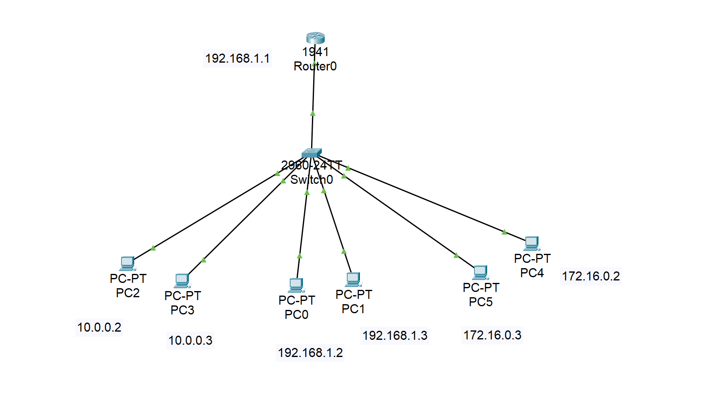
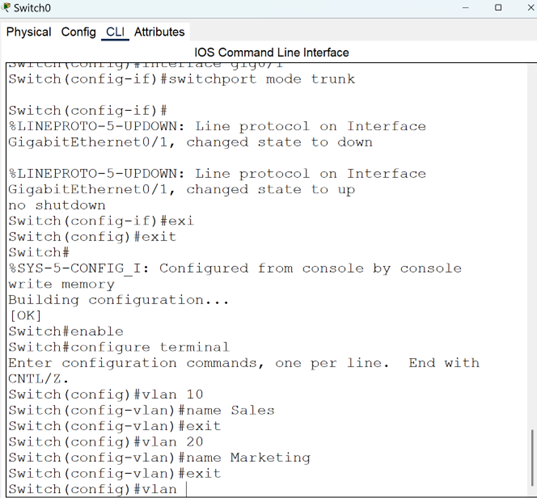
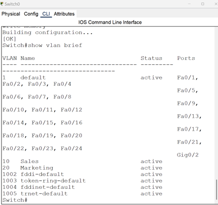

# csci4770-network-lab
## Lab Topology

---

## Lab 3: VLANs and Routing on a Stick

This lab demonstrates how to segment a network using VLANs and configure inter-VLAN routing using a single router interface (Router-on-a-Stick).

### Objectives

- Create multiple VLANs
- Assign switch ports to VLANs
- Configure trunking between the switch and router
- Configure subinterfaces on the router for each VLAN
- Verify connectivity across VLANs

### Topology

### Devices Used

- 1 Router (1941)
- 1 Switch (2960)
- 3 PCs (each in different VLANs)

### Key Configuration Steps

1. **Create VLANs on the Switch**
2. **Assign Ports to VLANs**
3. **Set Trunk Port to Router**
4. **Create Subinterfaces on Router**
5. **Assign IP Addresses**
6. **Enable Routing**
7. **Test Inter-VLAN Connectivity with Ping**

### Sample Output

📎 *See screenshots in `/screenshots/lab3/` folder for verification of pings, VLAN config, and subinterfaces.*

---

### VLAN Configuration

### Verification Output

---

## 🧪 Lab 3 – VLANs and Router-on-a-Stick Configuration

This lab focused on setting up VLANs on a switch, assigning ports, configuring trunking, and implementing inter-VLAN routing on a router using subinterfaces.

### Objectives
- Create and assign VLANs to switch ports
- Configure trunking between the switch and router
- Set up router subinterfaces for each VLAN
- Enable inter-VLAN routing

### Topology

### VLAN Configuration
This screenshot shows my switch VLAN creation and port assignments:

### Verification
Ping test results and show commands confirm VLANs and routing are working as expected:

---
