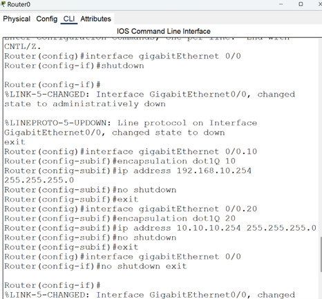

# Lab 3: VLANs and Router-on-a-Stick

This lab demonstrates how to segment a network using VLANs and route inter-VLAN traffic using a single physical router interface (Router-on-a-Stick).

## 🧠 Objectives

- Create multiple VLANs on a switch
- Assign switch ports to different VLANs
- Configure a trunk link between switch and router
- Implement Router-on-a-Stick using subinterfaces
- Assign static IPs to end devices
- Test network connectivity with ping

---

## 🖼️ Topology

---

## 🔧 Step-by-Step Configuration

### 1. **VLAN Configuration**

We created VLANs 10 and 20 and assigned ports to each VLAN.

### 2. **VLAN Verification**

We confirmed VLANs and port assignments with `show vlan brief`.

---

### 3. **Trunk Port Setup**

The trunk was set on interface Gig0/1 to carry multiple VLANs to the router.

---

### 4. **Router Subinterfaces (Router-on-a-Stick)**

Created subinterfaces on Router0 for each VLAN with appropriate IP addresses.

### 5. **Router Verification**

Confirmed subinterface IP assignments using `show ip interface brief`.

---

### 6. **Static IP Configuration**

PCs were manually assigned IP addresses and gateways within their VLAN ranges.

- **PC1 (VLAN 10):**

  

- **PC3 (VLAN 20):**

  

---

### 7. **Connectivity Test**

- PC1 successfully pinged 10.10.10.1

  

- PC3 successfully pinged 10.10.10.2

  

---

## ✅ Outcome

- VLANs successfully segmented the switch
- Trunking and Router-on-a-Stick enabled inter-VLAN routing
- All PCs could communicate within and across VLANs

---

## 💡 Technologies Used

- Cisco Packet Tracer
- Cisco 2960 switch
- Cisco 1941 router
- PC-PT devices
